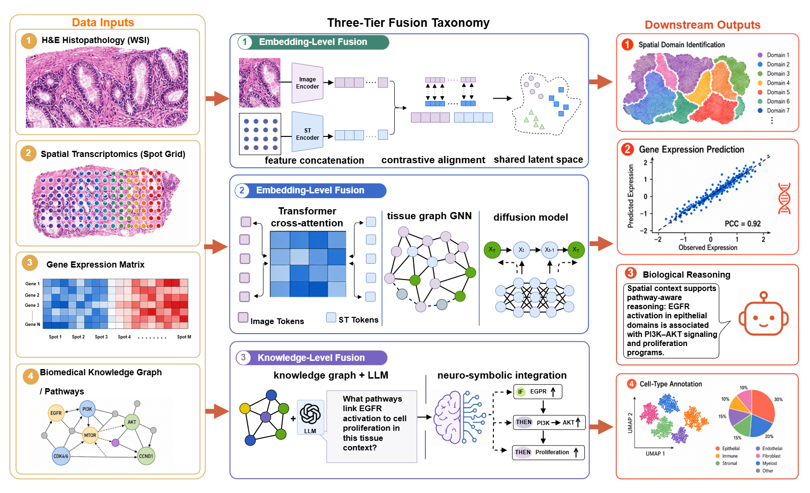

# Awesome ST-Path Survey: Multimodal Fusion for Spatial Transcriptomics and Pathology

<p align="center">
  
</p>


<p align="center">
  <a href="https://github.com/ChlorineHi/ST-Path-Survey/stargazers"></a>
  <a href="https://github.com/ChlorineHi/ST-Path-Survey/network/members"></a>
  <a href="https://github.com/ChlorineHi/ST-Path-Survey"></a>
  <a href="https://github.com/ChlorineHi/ST-Path-Survey"></a>
</p>


A curated list of **datasets, papers, codes, benchmarks, and tools** for multimodal fusion between **spatial transcriptomics (ST)** and **histopathology / pathology images**.

This repository accompanies the survey:

> **From Representation Learning to Foundation Models: A Survey of Multimodal Fusion for Spatial Transcriptomics and Pathology**  
> Jingxuan Wang, Dayu Hu

The survey organizes the field into three levels:

- **Embedding-level fusion**: feature aggregation, adaptive weighting, shared subspace learning, contrastive alignment.
- **Model-level fusion**: Transformer cross-interaction, graph/topological fusion, generative modeling.
- **Knowledge-level fusion**: biological priors, pathway graphs, biomedical knowledge graphs, foundation models, and LLM-assisted reasoning.

Contributions are welcome. Please open an issue or pull request if you find missing papers, wrong links, or newly released datasets.

---

## News

- **2026-04-19**: Reorganized the repository into an Awesome-style resource list; added paper/code tables, dataset resources, benchmark tasks, and evaluation metrics.
- **2026-04-19**: Added recent multimodal ST-pathology resources including OmiCLIP, STPath, GHIST, STHELAR, TITAN, scGPT-spatial, HESCAPE, CosMx, Xenium, and Visium HD entries.

---

# Bookmarks

- [Survey Papers](#survey-papers)
- [Datasets and Resources](#datasets-and-resources)
  - [Mainstream ST and Pathology Data Resources](#mainstream-st-and-pathology-data-resources)
  - [Benchmark Cohorts](#benchmark-cohorts)
  - [Spatial Omics Databases and Hubs](#spatial-omics-databases-and-hubs)
- [Papers and Code by Taxonomy](#papers-and-code-by-taxonomy)
  - [Embedding-Level Fusion](#embedding-level-fusion)
  - [Model-Level Fusion](#model-level-fusion)
  - [Knowledge-Level Fusion and Foundation Models](#knowledge-level-fusion-and-foundation-models)
- [Evaluation Metrics](#evaluation-metrics)
- [Useful Libraries and Software](#useful-libraries-and-software)
- [How to Contribute](#how-to-contribute)
- [Citation](#citation)

---

# Survey Papers

| Year | Title                                                        | Venue                 | Link                                                         | Notes                                                        |
| ---- | ------------------------------------------------------------ | --------------------- | ------------------------------------------------------------ | ------------------------------------------------------------ |
| 2026 | From Representation Learning to Foundation Models: A Survey of Multimodal Fusion for Spatial Transcriptomics and Pathology | Manuscript            | [Repository](https://github.com/ChlorineHi/ST-Path-Survey)   | This survey; three-tier taxonomy of embedding-, model-, and knowledge-level fusion. |
| 2025 | Combining spatial transcriptomics with tissue morphology     | Nature Communications | [Paper](https://www.nature.com/articles/s41467-025-58989-8)  | Review focused on morphology integration in ST.              |
| 2025 | Benchmarking the translational potential of spatial gene expression prediction from histology | Nature Communications | [Paper](https://www.nature.com/articles/s41467-025-56618-y)  | Benchmark of histology-to-expression prediction methods.     |
| 2024 | Deep learning in integrating spatial transcriptomics with other modalities | Review                | [Paper](https://pmc.ncbi.nlm.nih.gov/articles/PMC11725393/)  | Broad review of deep learning for multimodal ST.             |
| 2024 | Deep learning methods for spatial transcriptomics            | Review                | [Paper](https://academic.oup.com/bib/article/25/3/bbae181/7657952) | General ST deep learning background.                         |
| 2022 | Museum of spatial transcriptomics                            | Nature Methods        | [Paper](https://www.nature.com/articles/s41592-022-01409-2)  | Background resource for ST technologies and applications.    |

---

# Datasets and Resources

## Mainstream ST and Pathology Data Resources

| Resource / Dataset                                           | Platform / Scale                           | Paired Modalities / Annotation                               | Typical Use                                                  | Links                                                        |
| ------------------------------------------------------------ | ------------------------------------------ | ------------------------------------------------------------ | ------------------------------------------------------------ | ------------------------------------------------------------ |
| Human DLPFC / spatialLIBD                                    | 10x Visium, spot-level                     | H&E, spatial gene expression, manual cortical-layer / white-matter labels | Spatial domain clustering, representation learning, benchmark evaluation | [Paper](https://pmc.ncbi.nlm.nih.gov/articles/PMC8095368/) / [Project](https://research.libd.org/spatialDLPFC/) / [spatialLIBD](https://research.libd.org/spatialLIBD/articles/spatialLIBD.html) |
| 10x Visium Public Datasets                                   | 10x Visium, spot-level                     | H&E + gene expression                                        | General ST-pathology benchmarking                            | [10x Datasets](https://www.10xgenomics.com/datasets?product=spatial) |
| Visium HD Mouse Brain FFPE                                   | Visium HD, 2 × 2 μm bins                   | H&E + high-resolution spatial gene expression                | Super-resolution, fine-grained morphology-expression alignment | [Dataset](https://www.10xgenomics.com/datasets/visium-hd-cytassist-gene-expression-libraries-of-mouse-brain-he-v4) |
| Xenium Human Breast Cancer FFPE                              | Xenium Prime 5K / in situ                  | Morphology images, cell segmentation, targeted transcripts   | Single-cell/subcellular spatial benchmarking, cell-state analysis | [Dataset](https://www.10xgenomics.com/datasets/xenium-prime-ffpe-human-breast-cancer) |
| Xenium Human Breast Dataset Explorer                         | Xenium in situ                             | H&E/DAPI, 280-gene breast panel + custom genes               | Interactive breast tumor exploration                         | [Explorer](https://www.10xgenomics.com/products/xenium-in-situ/human-breast-dataset-explorer) |
| Xenium Human Pancreatic Cancer                               | Xenium in situ                             | FFPE tissue, cancer panel, subcellular transcript localization | Tumor microenvironment analysis                              | [Explorer](https://www.10xgenomics.com/products/xenium-human-pancreatic-dataset-explorer) |
| CosMx SMI FFPE Datasets                                      | CosMx SMI, single-cell/subcellular         | RNA ± protein, morphology, FFPE tissue                       | Spatial cell atlas, cell-cell interaction, high-plex in situ analysis | [Datasets](https://nanostring.com/products/cosmx-spatial-molecular-imager/ffpe-dataset/) |
| CosMx NSCLC FFPE Dataset                                     | CosMx SMI prototype                        | 960-plex RNA, FFPE NSCLC, cell-type atlas                    | Tumor microenvironment, ligand-receptor analysis             | [Dataset](https://nanostring.com/products/cosmx-spatial-molecular-imager/ffpe-dataset/nsclc-ffpe-dataset/) |
| HER2-positive Breast Cancer ST                               | Spatial Transcriptomics / H&E              | 36 breast cancer sections, H&E, count matrices, pathologist annotations | Histology-to-expression prediction, tumor region analysis    | [Data/Code](https://github.com/almaan/her2st) / [Paper](https://www.nature.com/articles/s41467-021-26271-2) |
| MOSTA: Mouse Organogenesis Spatiotemporal Transcriptomic Atlas | Stereo-seq, high-resolution embryo atlas   | Spatial gene expression, embryo sections, annotations        | Developmental atlas, large-FOV high-resolution ST            | [Portal](https://db.cngb.org/stomics/mosta/) / [Dataset](https://db.cngb.org/stomics/datasets/STDS0000058/data) / [Paper](https://www.cell.com/cell/fulltext/S0092-8674(22)00426-1) |
| Postnatal Mouse Brain Atlas                                  | Stereo-seq, cellular-resolution bins       | Whole-brain spatial transcriptome with anatomical context    | Brain tissue architecture, high-resolution spatial representation | [Dataset](https://db.cngb.org/stomics/datasets/STDS0000139)  |
| STHELAR                                                      | Multi-tissue ST + histology                | Histology-linked spatial transcriptomics for cell-type annotation | Multitissue cell annotation and benchmark development        | [Paper](https://www.nature.com/articles/s41597-026-06937-6)  |
| HESCAPE                                                      | Large-scale histology-expression benchmark | H&E + spatial gene expression                                | Cross-modal contrastive pretraining benchmark                | [Paper](https://huggingface.co/papers/2508.01490)            |

## Benchmark Cohorts

| Dataset / Cohort                      | Platform                        | Main Task                                                 | Common Metrics                                               | Notes                                                        |
| ------------------------------------- | ------------------------------- | --------------------------------------------------------- | ------------------------------------------------------------ | ------------------------------------------------------------ |
| Human DLPFC / spatialLIBD             | Visium                          | Spatial domain clustering                                 | ARI, NMI, AMI, spatial continuity                            | Most common clustering benchmark due to manual cortical-layer labels. |
| HER2-positive Breast Cancer           | ST / H&E                        | Histology-to-expression prediction, tumor-domain analysis | PCC, MSE, Spearman correlation, marker recovery              | Frequently used by ST-Net, Hist2ST, THItoGene, BLEEP, and related models. |
| Cutaneous Squamous Cell Carcinoma     | ST / H&E                        | Gene expression prediction                                | PCC, MSE, gene-wise correlation                              | Common histology-to-expression benchmark.                    |
| 10x Human Breast Cancer / Mouse Brain | Visium / Visium HD              | Spatial clustering, prediction, super-resolution          | ARI, PCC, MSE                                                | Useful for comparing spot-level and high-definition spatial platforms. |
| Xenium and CosMx public datasets      | Imaging-based in situ           | Cell typing, cell-state annotation, cell-cell interaction | Cell-type F1, annotation agreement, spatial neighborhood statistics | Better suited for single-cell/subcellular benchmarks.        |
| HESCAPE                               | Large-scale paired ST-pathology | Contrastive pretraining and retrieval                     | Retrieval accuracy, embedding alignment, transfer performance | Designed for cross-modal learning rather than only clustering. |

## Spatial Omics Databases and Hubs

| Database / Hub            | Description                                                  | Link                                                         |
| ------------------------- | ------------------------------------------------------------ | ------------------------------------------------------------ |
| STOmicsDB                 | Comprehensive spatial transcriptomics portal integrating datasets, publications, tools, analysis, visualization, and submission. | [Portal](https://db.cngb.org/stomics/) / [Paper](https://academic.oup.com/nar/article/52/D1/D1053/7416388) |
| SODB                      | Spatial Omics DataBase with data resources and interactive analysis modules. | [Paper](https://www.nature.com/articles/s41592-023-01773-7)  |
| spatialLIBD               | R/Bioconductor package and data portal for human DLPFC Visium data. | [Package](https://research.libd.org/spatialLIBD/articles/spatialLIBD.html) / [Paper](https://bmcgenomics.biomedcentral.com/articles/10.1186/s12864-022-08601-w) |
| 10x Genomics Datasets     | Official public datasets for Visium, Visium HD, and Xenium.  | [Datasets](https://www.10xgenomics.com/datasets)             |
| NanoString CosMx Datasets | Official public CosMx SMI FFPE datasets.                     | [Datasets](https://nanostring.com/products/cosmx-spatial-molecular-imager/ffpe-dataset/) |
| STOMICS Tools             | Tool index for spatial transcriptomics methods.              | [Tools](https://db.cngb.org/stomics/tools/)                  |

---

# Papers and Code by Taxonomy

## Embedding-Level Fusion

Embedding-level methods first encode modalities separately, then aggregate, align, or project them into a shared representation space.

| Year | Method         | Title / Description                                          | Fusion Mechanism                                            | Paper                                                        | Code / Resource                                              |
| ---- | -------------- | ------------------------------------------------------------ | ----------------------------------------------------------- | ------------------------------------------------------------ | ------------------------------------------------------------ |
| 2020 | SpaCell        | Integrating tissue morphology and spatial gene expression to predict disease cells | CNN + autoencoder + feature concatenation                   | [Paper](https://academic.oup.com/bioinformatics/article/36/7/2293/5663455) | [Code](https://github.com/BiomedicalMachineLearning/SpaCell) |
| 2020 | stLearn        | Integrating spatial location, tissue morphology and gene expression | Morphology-guided normalization / refinement                | [Preprint](https://doi.org/10.1101/2020.05.31.125658)        | [Code](https://github.com/BiomedicalMachineLearning/stlearn_manuscript) |
| 2021 | SpaGCN         | Integrating gene expression, spatial location and histology by graph convolution | Histology-aware graph construction + GCN                    | [Paper](https://www.nature.com/articles/s41592-021-01255-8)  | [Code](https://github.com/jianhuupenn/SpaGCN)                |
| 2022 | DeepST         | Identifying spatial domains in spatial transcriptomics by deep learning | Morphology feature augmentation + denoising AE + VGAE       | [Paper](https://pmc.ncbi.nlm.nih.gov/articles/PMC9825193/)   | [Code](https://github.com/JiangBioLab/DeepST)                |
| 2022 | conST          | Interpretable multimodal contrastive learning for spatial transcriptomics | Contrastive alignment of gene, spatial and morphology views | [Preprint](https://doi.org/10.1101/2022.01.14.476408)        | [Code](https://github.com/ys-zong/conST)                     |
| 2023 | BLEEP          | Spatially resolved gene expression prediction from H&E via bi-modal contrastive learning | Image-expression contrastive shared embedding               | [Paper](https://proceedings.neurips.cc/paper_files/paper/2023/hash/df656d6ed77b565e8dcdfbf568aead0a-Abstract-Conference.html) | [Code](https://github.com/bowang-lab/BLEEP)                  |
| 2024 | iIMPACT        | Integrating image and molecular profiles for spatial transcriptomics analysis | Histology-based domain modeling + molecular/spatial context | [Paper](https://genomebiology.biomedcentral.com/articles/10.1186/s13059-024-03289-5) | -                                                            |
| 2025 | MuCST          | Restoring and integrating heterogeneous morphology images and ST data with contrastive learning | Denoising + contrastive compatible feature learning         | [Paper](https://genomemedicine.biomedcentral.com/articles/10.1186/s13073-025-01449-1) | -                                                            |
| 2025 | OmiCLIP / Loki | Visual-omics foundation model bridging histopathology and spatial transcriptomics | Large-scale visual-omics contrastive learning               | [Paper](https://www.nature.com/articles/s41592-025-02707-1)  | -                                                            |

## Model-Level Fusion

Model-level methods explicitly embed cross-modal interaction inside the architecture, e.g., cross-attention, graph message passing, hypergraphs, and generative modules.

| Year | Method                                | Title / Description                                          | Fusion Mechanism                                             | Paper                                                        | Code / Resource                                              |
| ---- | ------------------------------------- | ------------------------------------------------------------ | ------------------------------------------------------------ | ------------------------------------------------------------ | ------------------------------------------------------------ |
| 2022 | STAGATE                               | Deciphering spatial domains with adaptive graph attention auto-encoder | Graph attention autoencoder                                  | [Paper](https://www.nature.com/articles/s41467-022-29439-6)  | [Code](https://github.com/zhanglabtools/STAGATE)             |
| 2022 | Hist2ST                               | Spatial transcriptomics prediction from histology through Transformer and GNN | CNN + Transformer + GNN + ZINB                               | [Tool Page](https://db.cngb.org/stomics/tools/STT0001396)    | [Code](https://github.com/biomed-AI/Hist2ST)                 |
| 2023 | GraphST                               | Spatially informed clustering, integration, and deconvolution | GNN + self-supervised contrastive learning                   | [Paper](https://www.nature.com/articles/s41467-023-36796-3)  | [Code](https://github.com/JinmiaoChenLab/GraphST)            |
| 2024 | SEDR                                  | Unsupervised spatially embedded deep representation of ST    | Masked AE + variational graph autoencoder                    | [Paper](https://genomemedicine.biomedcentral.com/articles/10.1186/s13073-024-01283-x) | [Code](https://github.com/JinmiaoChenLab/SEDR/)              |
| 2024 | THItoGene                             | Predicting spatial transcriptomics from histological images  | Dynamic convolution + capsule network + Transformer/GAT components | [Paper](https://pmc.ncbi.nlm.nih.gov/articles/PMC10749789/)  | [Code](https://github.com/yrjia1015/THItoGene)               |
| 2025 | GHIST                                 | Spatial gene expression at single-cell resolution from histology | Deep histology-to-expression inference                       | [Paper](https://www.nature.com/articles/s41592-025-02795-z)  | -                                                            |
| 2025 | STMCL                                 | Inferring multi-slice spatial gene expression from H&E       | Multimodal contrastive learning                              | [Paper](https://www.sciencedirect.com/science/article/pii/S1046202324002834) | -                                                            |
| 2025 | STFlow                                | Scalable generation of spatial transcriptomics from histology images via whole-slide flow matching | Flow matching / generative modeling                          | [Code](https://github.com/Graph-and-Geometric-Learning/STFlow) | [Code](https://github.com/Graph-and-Geometric-Learning/STFlow) |
| 2025 | Cross-modal mask reconstruction model | Spatial transcriptomics expression prediction from histopathology | Mask reconstruction + contrastive learning                   | [Paper](https://www.sciencedirect.com/science/article/pii/S1361841525004359) | -                                                            |

## Knowledge-Level Fusion and Foundation Models

Knowledge-level methods introduce biological priors, pathway structures, knowledge graphs, foundation models, or language-mediated reasoning.

| Year | Method                        | Title / Description                                          | Knowledge / Foundation Component                           | Paper                                                       | Code / Resource                                       |
| ---- | ----------------------------- | ------------------------------------------------------------ | ---------------------------------------------------------- | ----------------------------------------------------------- | ----------------------------------------------------- |
| 2023 | Geneformer                    | Transfer learning enables predictions in network biology     | Transcriptomic foundation model                            | [Paper](https://www.nature.com/articles/s41586-023-06139-9) | [Model](https://huggingface.co/ctheodoris/Geneformer) |
| 2024 | scGPT                         | Toward building a foundation model for single-cell multi-omics | Single-cell foundation model                               | [Paper](https://www.nature.com/articles/s41592-024-02201-0) | [Code](https://github.com/bowang-lab/scGPT)           |
| 2025 | scGPT-spatial                 | Continual pretraining of single-cell foundation model for spatial transcriptomics | Spatial foundation model / SpatialHuman30M                 | [Preprint](https://doi.org/10.1101/2025.02.05.636714)       | [Code](https://github.com/bowang-lab/scGPT-spatial)   |
| 2025 | STPath                        | Generative foundation model for integrating ST and whole-slide images | Generative ST-pathology foundation model                   | [Paper](https://www.nature.com/articles/s41746-025-02020-3) | -                                                     |
| 2025 | TITAN                         | Multimodal whole-slide foundation model for pathology        | WSI-image-text foundation model                            | [Paper](https://www.nature.com/articles/s41591-025-03982-3) | [Code](https://github.com/mahmoodlab/TITAN)           |
| 2025 | OmiCLIP                       | Visual-omics foundation model to bridge histopathology with spatial transcriptomics | Visual-omics contrastive pretraining                       | [Paper](https://www.nature.com/articles/s41592-025-02707-1) | -                                                     |
| 2025 | Pathway / graph prior methods | Pathway-aware or graph-grounded multimodal ST learning       | Pathway graph, gene graph, or biological prior constraints | -                                                           | -                                                     |
| 2026 | STHELAR                       | Multi-tissue dataset linking ST and histology for cell-type annotation | Data resource for multimodal cell annotation               | [Paper](https://www.nature.com/articles/s41597-026-06937-6) | -                                                     |

---

# Evaluation Metrics

| Category                        | Representative Tasks                                         | Common Metrics                                               | Notes                                                        |
| ------------------------------- | ------------------------------------------------------------ | ------------------------------------------------------------ | ------------------------------------------------------------ |
| Representation quality          | Spatial domain identification, clustering, embedding quality | ARI, NMI, AMI, silhouette score, spatial continuity          | Use when ground-truth anatomical/pathological labels are available. |
| Cross-modal alignment           | Image-expression retrieval, contrastive pretraining, shared latent space | Recall@K, retrieval accuracy, cosine similarity, alignment score | Useful for CLIP-style and foundation-model-style alignment.  |
| Generation / prediction quality | Histology-to-expression prediction, imputation, super-resolution | PCC, Spearman correlation, MSE, MAE, RMSE, gene-wise correlation | PCC captures trend; MSE/MAE quantify numerical deviation.    |
| Biological validity             | Marker recovery, pathway preservation, cell-type consistency | Marker-gene AUC, pathway enrichment consistency, gene-gene correlation preservation | Important for avoiding visually plausible but biologically false outputs. |
| Reasoning quality               | QA, report generation, text explanation, retrieval-augmented interpretation | BERTScore, factual consistency, expert evaluation            | Automatic metrics should be paired with domain expert review. |
| Robustness / transfer           | Cross-tissue, cross-platform, cross-lab generalization       | External cohort performance, domain shift score, batch-mixing metrics | Critical for foundation models and clinical translation.     |

---

# Useful Libraries and Software

| Tool            | Type                                  | Use                                                 | Link                                                         |
| --------------- | ------------------------------------- | --------------------------------------------------- | ------------------------------------------------------------ |
| Scanpy          | Python single-cell / spatial analysis | Preprocessing, clustering, visualization            | [Link](https://scanpy.readthedocs.io/)                       |
| Squidpy         | Python spatial omics analysis         | Spatial graphs, image features, spatial statistics  | [Link](https://squidpy.readthedocs.io/)                      |
| Seurat          | R single-cell / spatial analysis      | Visium analysis, integration, visualization         | [Link](https://satijalab.org/seurat/)                        |
| Giotto          | R/Python spatial omics toolbox        | End-to-end ST analysis and visualization            | [Link](https://giottosuite.readthedocs.io/)                  |
| spatialLIBD     | R/Bioconductor                        | DLPFC data access and visualization                 | [Link](https://research.libd.org/spatialLIBD/)               |
| stLearn         | Python ST toolkit                     | SME normalization, clustering, spatial trajectory   | [Link](https://stlearn.readthedocs.io/)                      |
| SpaGCN          | Python method                         | Histology-aware spatial graph clustering            | [Link](https://github.com/jianhuupenn/SpaGCN)                |
| DeepST          | Python method                         | Spatial domain identification and batch integration | [Link](https://github.com/JiangBioLab/DeepST)                |
| STAGATE         | Python method                         | Graph attention autoencoder for spatial domains     | [Link](https://github.com/zhanglabtools/STAGATE)             |
| GraphST         | Python method                         | Spatial clustering, integration, deconvolution      | [Link](https://github.com/JinmiaoChenLab/GraphST)            |
| SEDR            | Python method                         | Spatial embedding, imputation, denoising            | [Link](https://github.com/JinmiaoChenLab/SEDR/)              |
| Hist2ST         | Python method                         | Histology-to-expression prediction                  | [Link](https://github.com/biomed-AI/Hist2ST)                 |
| THItoGene       | Python method                         | Histology-to-expression prediction                  | [Link](https://github.com/yrjia1015/THItoGene)               |
| Space Ranger    | 10x official pipeline                 | Visium / Visium HD processing                       | [Link](https://www.10xgenomics.com/support/software/space-ranger/latest) |
| Xenium Explorer | 10x official viewer                   | Xenium visualization                                | [Link](https://www.10xgenomics.com/products/xenium-explorer) |
| AtoMx SIP       | NanoString platform                   | CosMx / GeoMx spatial data analysis                 | [Link](https://nanostring.com/products/atomx-spatial-informatics-platform/) |

---

# How to Contribute

Please add new resources using the following format:

```markdown
| Year | Method / Dataset | Title / Description | Task / Category | Paper | Code / Data |
```

Recommended contribution rules:

1. Prefer official paper, DOI, PubMed, arXiv, or publisher links.
2. Prefer official code repositories over unofficial forks.
3. For datasets, include platform, tissue, paired modalities, and annotations whenever possible.
4. Mark unavailable code as `-` rather than linking to unrelated repositories.
5. If a method is not specific to ST-pathology fusion but is relevant to foundation models or knowledge grounding, add a short note explaining the connection.

---

# Citation

If this survey or repository is useful to your research, please consider citing:

```bibtex
@article{wang2026stpathsurvey,
  title   = {From Representation Learning to Foundation Models: A Survey of Multimodal Fusion for Spatial Transcriptomics and Pathology},
  author  = {Wang, Jingxuan and Hu, Dayu},
  journal = {Under review},
  year    = {2026},
  url     = {https://github.com/ChlorineHi/ST-Path-Survey}
}
```

---

# License

This repository is intended for academic resource collection and literature tracking. Please follow the license terms of each cited paper, code repository, dataset, and database.

---

_Last updated: 2026-04-19_
