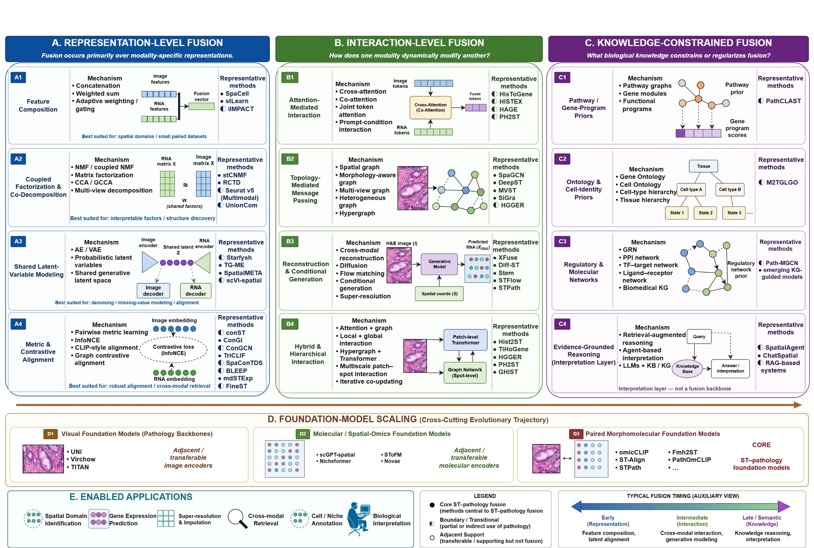

# ST-Path Survey

### Multimodal fusion for spatial transcriptomics and pathology

<p align="center">
  
</p>

<p align="center">
  <a href="https://github.com/ChlorineHi/ST-Path-Survey/stargazers"></a>
  <a href="https://github.com/ChlorineHi/ST-Path-Survey/network/members"></a>
  
  
</p>

This repository accompanies the survey:

> **From Representation Learning to Foundation Models: A Survey of Multimodal Fusion for Spatial Transcriptomics and Pathology**  
> Jingxuan Wang and Dayu Hu

It provides a living, scope-aware index of methods, datasets, benchmarks, evaluation practices, and open-source resources at the intersection of spatial transcriptomics (ST) and histopathology.

## What is new in this revision?

The repository now mirrors the revised methodological framework used in the manuscript. Methods are classified by their **dominant fusion mechanism**, while foundation-model scaling is treated as a **cross-cutting trajectory** rather than a fourth fusion tier.

| Level | Diagnostic question | Method families |
|---|---|---|
| **Representation-level fusion** | What modality-specific representations are coupled? | Feature composition; coupled factorization and co-decomposition; shared latent-variable modeling; metric and contrastive alignment |
| **Interaction-level fusion** | How does one modality dynamically modify another? | Attention-mediated interaction; topology-mediated message passing; reconstruction and conditional generation; hybrid and hierarchical interaction |
| **Knowledge-constrained fusion** | What biological knowledge constrains or regularizes fusion? | Pathway and gene-program priors; ontology and cell-identity priors; regulatory and molecular networks; evidence-grounded reasoning |
| **Foundation-model scaling** | Which reusable backbones or paired pretraining schemes enable transfer? | Pathology foundation models; molecular/spatial-omics foundation models; paired morphomolecular foundation models |

The detailed method map is available in [resources/methods.md](resources/methods.md).

## Scope labels

To avoid conflating central ST–pathology fusion with the broader spatial-omics and computational-pathology literature, every resource should be interpreted using one of three scope labels:

- **Core** — paired spatial molecular measurements and histopathology are jointly used in the same modeling pipeline.
- **Boundary / transitional** — pathology is used partially or indirectly, or the method provides a technically relevant bridge without full paired multimodal fusion.
- **Adjacent support** — the work contributes a transferable encoder, spatial backbone, benchmark, knowledge resource, or interpretation system, but is not itself an ST–pathology fusion method.

See [resources/inclusion-criteria.md](resources/inclusion-criteria.md) for operational inclusion and classification rules.

## Repository map

| Path | Contents |
|---|---|
| [`resources/methods.md`](resources/methods.md) | Revised taxonomy, representative methods, and task mapping |
| [`resources/datasets.md`](resources/datasets.md) | Paired datasets, platform regimes, and benchmark cohorts |
| [`resources/evaluation.md`](resources/evaluation.md) | Task-specific metrics and recommended evaluation protocol |
| [`resources/inclusion-criteria.md`](resources/inclusion-criteria.md) | Search scope, scope labels, and decidable classification axes |
| [`assets/figures/`](assets/figures/) | Survey figures used by the repository |
| [`CONTRIBUTING.md`](CONTRIBUTING.md) | Contribution and evidence requirements |
| [`CITATION.cff`](CITATION.cff) | Machine-readable citation metadata |

## Downstream applications

The taxonomy covers methods enabling:

- spatial-domain identification;
- histology-guided gene-expression prediction;
- molecular super-resolution and imputation;
- cross-modal retrieval;
- cell-type and tissue-niche annotation; and
- biologically grounded interpretation.

## Benchmarking principle

No single score adequately evaluates ST–pathology fusion. A credible comparison should align the dataset regime, split strategy, task, and metric family, and should report biological validity and cross-cohort transfer alongside numerical accuracy. The recommended checklist is summarized in [resources/evaluation.md](resources/evaluation.md).

## News

- **2026-08-16** — Rebuilt the repository around the revised Representation–Interaction–Knowledge taxonomy; added explicit scope labels, foundation-model scaling, modular resource pages, contribution templates, and the updated taxonomy figure.
- **2026-04-19** — Initial Awesome-style collection of papers, datasets, tools, and benchmark resources.

## Contributing

New papers, corrected classifications, code releases, and dataset updates are welcome. Please read [CONTRIBUTING.md](CONTRIBUTING.md) and use the issue or pull-request templates. Entries should link to primary sources and state whether the work is peer reviewed or a preprint.

## Citation

If this survey or repository supports your work, please cite:

```bibtex
@article{wang2026stpathsurvey,
  title   = {From Representation Learning to Foundation Models: A Survey of Multimodal Fusion for Spatial Transcriptomics and Pathology},
  author  = {Wang, Jingxuan and Hu, Dayu},
  journal = {Manuscript in preparation},
  year    = {2026},
  url     = {https://github.com/ChlorineHi/ST-Path-Survey}
}
```

## Resource-use note

This repository indexes third-party papers, software, models, and datasets. Their original licenses and terms remain authoritative. The taxonomy figure and repository curation should be attributed to the survey authors.

_Last updated: 2026-08-16_
