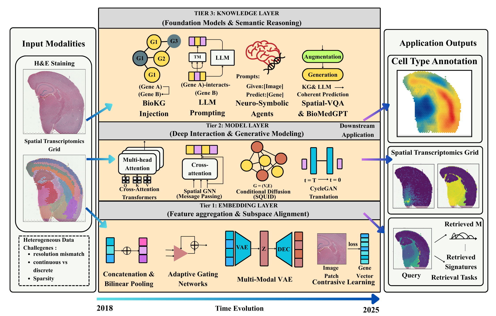

# Spatial Transcriptomics and Histopathology Integration: A Comprehensive Survey

<p align="center">
  
</p>

## Abstract

The integration of spatial transcriptomics (ST) and histopathology images represents a pivotal frontier in computational biology, bridging the gap between molecular genotypes and tissue phenotypes. However, this multimodal fusion faces inherent challenges including heterogeneity between continuous and discrete data modalities, resolution misalignment, and data sparsity.

This survey presents a systematic taxonomy that traces the evolutionary trajectory from classical representation learning to contemporary foundation models, organized into three hierarchical levels:

- **Embedding-level fusion** (feature aggregation and subspace alignment)
- **Model-level fusion** (deep interaction and generative modeling)
- **Knowledge-level fusion** (knowledge-driven semantic reasoning)

## Technical Advances

We comprehensively review technical advances spanning:

- Direct feature concatenation
- Adaptive gating mechanisms
- Variational autoencoders
- Cross-attention Transformers
- Graph neural networks
- Conditional diffusion models
- Neuro-symbolic architectures integrating biomedical knowledge graphs with large language models

## Knowledge-Level Fusion Paradigm

Distinctively, we emphasize the emerging paradigm of **knowledge-level fusion**, where structured biological priors from knowledge graphs are harmonized with the generative reasoning capabilities of foundation models to mitigate hallucination and enhance interpretability.

## Challenges and Future Directions

We critically examine persistent challenges including:

- Biological authenticity validation of large model outputs
- Context window limitations for gigapixel whole slide images
- The fundamental alignment between discrete symbolic knowledge and continuous neural representations

This survey not only consolidates the current state-of-the-art but also delineates future directions toward trustworthy and interpretable AI systems for precision pathology.

---

## Citation

If you find this survey helpful for your research, please consider citing:

```bibtex
@article{st_path_survey_2025,
  title={Spatial Transcriptomics and Histopathology Integration: From Representation Learning to Foundation Models},
  author={},
  journal={},
  year={2025}
}
```

## Contact

For any questions or suggestions, please feel free to open an issue or contact us.

---

*Last updated: March 2025*
